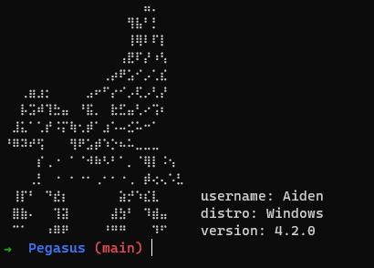

# Pegasus - OS-Based Hacking Shell

    

<!-- TOC -->
- [Introduction](#introduction)
- [Usage](#usage)
- [Prompt Styles](#prompt-styles)
- [Docker Installation](#docker-installation)
    - [Local Install](#local-install)
    - [Docker Hub Install (Recommended)](#docker-hub-install-recommended)
- [Features](#features)
- [Contribution](#contribution)
- [License](#license)
- [Disclaimer](#disclaimer)
<!-- TOC -->

## Introduction

Pegasus is a powerful hacking shell designed for Unix-based operating systems. It provides various tools and functionalities that can be used for security testing and ethical hacking purposes. This tool is intended for educational and responsible use only. Please use it responsibly and with proper authorization.

## Usage

Once Pegasus is successfully installed, you can run it by executing the `go run main.go` command in your terminal:

If you want a new style prompt run `go run main.go -style=<prompt>`
## Prompt styles

- windows
- root
- zsh, zsh-git
- mac
- hacker

## Docker installation

### Local install
If you prefer to build the Docker image locally, execute the following commands:

`docker build -t pegasus .`

`docker run -it pegasus`

### Docker hub install (recommended)
For a more straightforward installation, you can pull the Docker image from Docker Hub:

`docker pull nebrix/pegasus`

`docker run -it nebrix/pegasus`

Using the Docker Hub image is the recommended and easier approach for most users.

## Features

Pegasus comes with a variety of hacking and security testing tools, including:

- ICMP Ping (ping): Send ICMP echo requests to check if a host is up.
- DNS Enumeration (dns): Perform DNS enumeration on a domain to gather information.
- WHOIS Lookup (whois): Retrieve WHOIS information for a domain.
- IP Lookup (lookup): Retrieve basic information about an IP address.
- Hash (hash): Generate a hash value.
- Get Ip (ip): gets local and public IP address for currently connected network.
- Subnet Calculator (subnet): Calculate subnet details and IP ranges.

## Contribution

If you find any bugs or want to contribute to Pegasus, please feel free to open an issue or submit a pull request on the GitHub repository. We welcome your feedback and suggestions to make this tool even better.

## License

Pegasus is open-source software licensed under the [MIT License](https://github.com/Codezz-ops/Pegasus-Go/blob/main/COPYING). You are free to use, modify, and distribute this software with proper attribution and in compliance with the license terms.

## Disclaimer

Pegasus is provided for educational and ethical hacking purposes only. The authors and contributors of Pegasus are not responsible for any misuse or illegal activities performed using this tool. Please use it responsibly and in compliance with the laws and regulations of your country.
